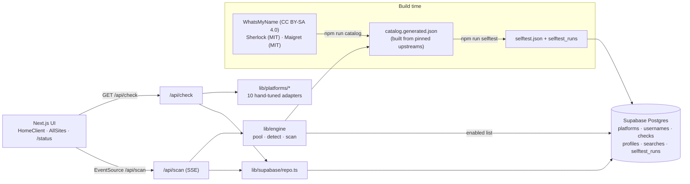

# Handle Hub

Check one username across **10 hand-tuned core platforms** (Steam, Xbox, PlayStation, Twitch, X, Instagram, TikTok, Discord, Reddit, YouTube) **plus 1,500+ self-tested sites**. Detection rules come from the open-source WhatsMyName, Sherlock and Maigret catalogs. Results stream live, taken handles link to the profile, and free ones link to the signup page.

**Honesty rule:** if a platform's answer is ambiguous (a bot wall, captcha, rate limit, login wall, regional block or odd response), the result is `unknown`. Handle Hub never guesses `available` or `taken`.

## Architecture



- **Core adapters** (`lib/platforms/`) use the most reliable public method for each platform and enrich taken results with public profile data (avatar, display name, followers…).
- **Catalog engine** (`lib/engine/`):
  - `build-catalog` merges and normalizes the three upstream catalogs. Sites are de-duplicated by host, preferring WMN, then Maigret, then Sherlock. Core platforms are excluded (the adapters always win), and NSFW sites are flagged.
  - `detect.ts` applies strict rules: exists/missing status codes and markers, with redirects handled manually. Challenge pages (Cloudflare, DDoS-Guard, PerimeterX, captcha) → `unknown`.
  - `pool.ts` runs probes with global concurrency (48 for scans) and at most 2 requests per host, an 8s timeout, and one retry with backoff on 429/5xx.
  - `scan.ts` is an async generator that streams results until a 50s budget runs out. Sites still pending at the deadline come back `unknown (deadline)`.
- **Self-test** (`npm run selftest`): every definition must report its upstream *known* account as **taken** and two random handles as **available**. Sites that fail, or average more than 4s, are disabled. Results are stored in `selftest_runs` and `platforms.enabled`, and in `data/sites/selftest.json` as a fallback.

## Current numbers (self-test of 2026-10-06)

| | Count |
| --- | --- |
| Upstream definitions | 3,277 (WMN 692 · Maigret 2,115 · Sherlock 470) |
| Unique sites after merge | 2,554 |
| Passing & enabled | 1,529 (1,501 shown; NSFW never shown) |
| Disabled | 1,025 (blocked 260 · wrong status 259 · no marker for random 160 · network 120 · **random→taken 82** · slow 18 · …) |
| False positives on a random handle (`/api/scan`) | **0 / 1,501 (0%)** |
| `/api/scan ninja` | 587 taken · 871 available · 43 unknown in ~42s |

## Core platforms

| Platform | Method (no keys) | Confidence | Optional keys | Limitations |
| --- | --- | --- | --- | --- |
| Steam | community XML vanity lookup | medium | `STEAM_API_KEY` → ResolveVanityURL (high) | Checks the custom URL namespace, not persona names. |
| Xbox | xboxgamertag.com public lookup (rule from WMN/Sherlock/Maigret), with gamerpic and gamerscore | medium | `XBOX_AUTHORIZATION` + `XBOX_RESERVATION_ID` (true reservation check), `OPENXBL_API_KEY` | The lookup site sometimes returns 503 → `unknown`. |
| PlayStation | Sony public `onlineIds` availability | high | — | Undocumented endpoint. |
| Twitch | public GQL user lookup | medium | `TWITCH_CLIENT_ID/SECRET` → Helix (high) | |
| X | **`api.x.com/i/users/username_available.json`** (signup availability, rule from WMN) plus syndication profile | high | `X_BEARER_TOKEN` → API v2 | Reflects X's own signup check; may rate-limit → `unknown`. |
| Instagram | `web_profile_info` with web app id + referer (rule from Maigret), falling back to `i.instagram.com` | medium when reachable | `INSTAGRAM_APP_ID` | Datacenter IPs get a login wall → `unknown`. Needs a residential-IP worker or the Graph API (business accounts only). |
| TikTok | oEmbed + public page | high when they agree | — | Some egress regions get redirected to a "blocked in your region" page → `unknown (platform_blocked)`. |
| Discord | `username-attempt-unauthed` | high | — | Aggressive rate limits → `unknown (rate_limited)`. |
| Reddit | `about.json` / `username_available.json` | high when reachable | **`REDDIT_CLIENT_ID/SECRET`** → official app-only OAuth (taken: high; not found: medium, since deleted names stay blocked) | Anonymous JSON is blocked from datacenter IPs. Add the free API keys. |
| YouTube | `/@handle` page | medium | `YOUTUBE_API_KEY` → `channels.list forHandle` (high) | |

**Out of scope by policy:** captcha solving, rotating or residential proxy pools to evade blocks, fake or stolen logins, account creation, private data, and anything that defeats an access control.

## Database (Supabase)

Schema in `supabase/migrations/20261006082759_normalized_schema_v2.sql`. RLS is on for every table: anon can only read, writes use the service role, and searches store only a salted daily IP hash (never the raw IP).

| Table / view | Purpose |
| --- | --- |
| `platforms` | One row per core adapter and catalog site: `source` (adapter/wmn/sherlock/maigret), `enabled`, `nsfw`, `signup_url`, `selftest_passed`, `health_score` (pass ratio of the last 5 runs) |
| `usernames` | `handle citext unique`, so `Ninja` = `ninja` |
| `checks` | One row per check: `status`, `reason`, `confidence`, `method`, `latency_ms`, `http_status`, `meta` |
| `profiles` | Latest public profile per (username, platform) |
| `searches` | Search log: `source` (check/scan), `platform_count`, `duration_ms`, `ip_hash` (hidden from anon by a column grant) |
| `selftest_runs` | Self-test history (`taken_ok`, `available_ok`, generated `passed`) |
| `latest_checks` (view) | Latest check per username × platform, joined with the platform name and category |
| `platform_health` (view) | 24h checks, unknown rate, avg latency and self-test state per platform (powers `/status`) |

Supabase advisors: **0 security findings**. Performance shows only INFO "unused index" notices for the new foreign-key/status indexes, which are kept intentionally.

Fresh results are cached for 10 min (core) and 30 min (catalog). Regenerate types with the Supabase CLI or MCP into `lib/supabase/types.ts`.

## Getting started

```bash
cp .env.example .env.local   # fill in the Supabase keys; everything else is optional
npm install
npm run catalog               # download pinned upstreams → data/sites/catalog.generated.json
npm run dev
```

`npm run build` runs `catalog --if-missing` automatically. Without the DB, the engine falls back to `data/sites/selftest.json` for the enabled list.

### Scripts

| Command | What it does |
| --- | --- |
| `npm run catalog` | Rebuild the merged catalog from the pinned upstream commits (`lib/engine/upstream.ts`) |
| `npm run selftest` | Self-test every definition (`--limit N`, `--concurrency N`, `--no-db`). Writes `selftest.json` and upserts `platforms` + `selftest_runs`. Prints a passed/disabled summary and top failure reasons |
| `npm run test:adapters` | Live check of the 10 core adapters |
| `npm run test:scan` | Engine smoke test: scans `ninja` and a random handle, reports the false-positive rate |

## Environment variables

| Variable | Used by |
| --- | --- |
| `NEXT_PUBLIC_SUPABASE_URL`, `NEXT_PUBLIC_SUPABASE_ANON_KEY` | Read access (status page, enabled list) |
| `SUPABASE_SERVICE_ROLE_KEY` | Server-only writes (checks, profiles, searches, self-test) |
| `IP_HASH_SALT` | Salt for `searches.ip_hash` |
| `REDDIT_CLIENT_ID`, `REDDIT_CLIENT_SECRET` | Reddit official OAuth |
| `XBOX_AUTHORIZATION`, `XBOX_RESERVATION_ID`, `OPENXBL_API_KEY` | Xbox reservation / OpenXBL |
| `X_BEARER_TOKEN` | X API v2 |
| `TWITCH_CLIENT_ID`, `TWITCH_CLIENT_SECRET` | Twitch Helix |
| `YOUTUBE_API_KEY` | YouTube Data API |
| `STEAM_API_KEY` | Steam Web API |
| `INSTAGRAM_APP_ID` | Instagram web app id override |

## API

- `GET /api/check?username=` → the 10 core results, with `confidence`, `reason`, `profile` and `cached` fields.
- `GET /api/scan?username=` → **Server-Sent Events**:
  - `meta` `{username, total, cached, source}`
  - `result` `{site, defId, name, category, status, reason, httpStatus, latencyMs, profileUrl, claimUrl, cached}` × N
  - `done` `{taken, available, unknown, invalid, total, durationMs}`
  - `ping` (keep-alive)

  Rate limit: 6 scans per minute per IP.
- `GET /api/recent` → recent searches.
- `/status` → platform health page.

## Limitations

- "Available" means the public profile doesn't exist. Some platforms reserve, ban or hold handles, so signup can still fail.
- Catalog sites change constantly. Re-run `npm run selftest` regularly (weekly is a good default) to disable sites that break.
- Results depend on the server's egress IP. Datacenter IPs get more bot walls than home connections, which raises the `unknown` rate for Instagram, Reddit, TikTok and some catalog sites.
- Hosting: `/api/scan` sets `maxDuration = 60` and has a 50s budget. On hosts with shorter function limits it ends early and reports the remaining sites as `unknown (deadline)`.

## Credits and licenses

Site detection data: [WhatsMyName](https://github.com/WebBreacher/WhatsMyName) (CC BY-SA 4.0), [Sherlock](https://github.com/sherlock-project/sherlock) (MIT) and [Maigret](https://github.com/soxoj/maigret) (MIT). See [THIRD_PARTY.md](THIRD_PARTY.md) and [data/sites/LICENSE-WMN.md](data/sites/LICENSE-WMN.md). WMN-derived data stays under CC BY-SA 4.0 in a separate generated data file.
