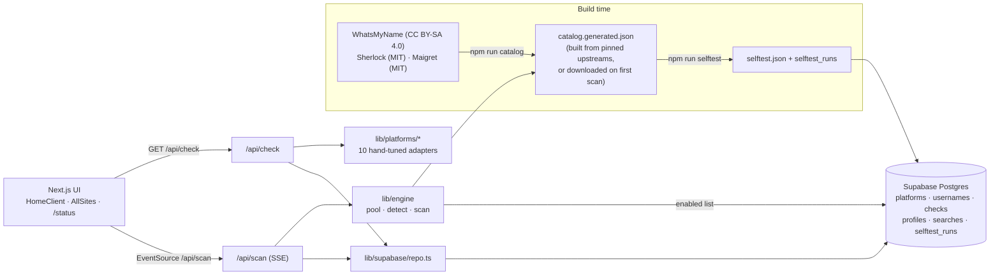

# Handle Hub

Check one username across **10 hand-tuned core platforms** (Steam, Xbox, PlayStation, Twitch, X, Instagram, TikTok, Discord, Reddit, YouTube) **plus 1,500+ self-tested sites**. Detection rules come from the open-source WhatsMyName, Sherlock and Maigret catalogs. Results stream live, taken handles link to the profile, and free ones link to the signup page.

**Honesty rule:** if a platform's answer is ambiguous (a bot wall, captcha, rate limit, login wall, regional block or odd response), the result is `unknown`. Handle Hub never guesses `available` or `taken`.

## Architecture



- **Core adapters** (`lib/platforms/`) validate the handle against each platform's own rules first (`rules.ts`), then try a **chain of public methods** (`chain.ts`): the first decisive answer wins, and `meta.method` / `meta.tried` record which method answered. Any platform that is still `unknown` gets an **automatic second pass ~2s later** that leads with a different method. Taken results are enriched with public profile data (avatar, display name, followers…).
- **Catalog engine** (`lib/engine/`):
  - `build-catalog` merges and normalizes the three upstream catalogs. Sites are de-duplicated by host, preferring WMN, then Maigret, then Sherlock. Core platforms are excluded (the adapters always win), and NSFW sites are flagged.
  - `detect.ts` applies strict rules: exists/missing status codes and markers, with redirects handled manually. Challenge pages (Cloudflare, DDoS-Guard, PerimeterX, captcha) → `unknown`.
  - `pool.ts` runs probes with global concurrency (48 for scans) and at most 2 requests per host, an 8s timeout, and one retry with backoff on 429/5xx.
  - `scan.ts` is an async generator that streams results until the budget runs out (90s self-hosted, 50s on Vercel, `SCAN_BUDGET_MS` overrides). Sites still pending at the deadline come back `unknown (deadline)`.
  - `catalog.ts` loads `data/sites/catalog.generated.json`. If it's missing (fresh clone, `npm run dev` with no build step), the server downloads the pinned upstream files once (raw.githubusercontent.com, then the jsDelivr mirror), builds the catalog in memory (~5–20s) and caches it on disk. The UI shows "Preparing site list…" meanwhile, and an error with **Retry scan** if the download fails.
- **Self-test** (`npm run selftest`): every definition must report its upstream *known* account as **taken** and two random handles as **available**. Sites that fail, or average more than 4s, are disabled. Results are stored in `selftest_runs` and `platforms.enabled`, and in `data/sites/selftest.json` as a fallback.

## Current numbers (self-test of 2026-10-06)

| | Count |
| --- | --- |
| Upstream definitions | 3,277 (WMN 692 · Maigret 2,115 · Sherlock 470) |
| Unique sites after merge | 2,554 |
| Passing & enabled | 1,529 (1,501 shown; NSFW never shown) |
| Disabled | 1,025 (blocked 260 · wrong status 259 · no marker for random 160 · network 120 · **random→taken 82** · slow 18 · …) |
| False positives on a random handle (`/api/scan`) | **0 / 1,501 (0%)** |
| `/api/scan ninja` | 587 taken · 871 available · 43 unknown in ~42s |

## Core platforms

Each platform is validated first (e.g. Xbox gamertags only allow letters, numbers and spaces, so `zixx__zuu` is **not allowed** on Xbox with a message suggesting `zixx zuu` / `zixxzuu`). Then methods run in order until one gives a decisive answer. If none does, the card says **Not verified**, explains why, and offers **Check on <platform>** (opens the public profile page) and **Retry**.

| Platform | Method chain (no keys) → second pass | Optional keys | Limitations |
| --- | --- | --- | --- |
| Steam | community XML vanity lookup | `STEAM_API_KEY` → ResolveVanityURL (high) | Checks the custom URL namespace, not persona names. |
| Xbox | xboxgamertag.com public lookup (rule from WMN/Sherlock/Maigret), with gamerpic and gamerscore | `XBOX_AUTHORIZATION` + `XBOX_RESERVATION_ID` (true reservation check), `OPENXBL_API_KEY` | `_` and other symbols aren't allowed in gamertags. The lookup site sometimes returns 503 → `unknown`. |
| PlayStation | Sony public `onlineIds` availability (high) | — | Undocumented endpoint. |
| Twitch | public GQL user lookup | `TWITCH_CLIENT_ID/SECRET` → Helix (high) | |
| X | `api.x.com/i/users/username_available.json` (signup check, rule from WMN) + syndication profile | `X_BEARER_TOKEN` → API v2 | May rate-limit → `unknown`. |
| Instagram | `www.instagram.com` `web_profile_info` → `i.instagram.com` `web_profile_info` → profile page `og:description` · pass 2 starts with the profile page | `INSTAGRAM_APP_ID` | Instagram rate-limits anonymous lookups per IP (datacenter IPs always; busy mobile/CGNAT IPs sometimes) → **Not verified** + "Check on Instagram". |
| TikTok | oEmbed → profile page JSON (`webapp.user-detail`) → **countik.com** public lookup · pass 2 starts with countik | — | tiktok.com is blocked in some countries (e.g. **India**), so the third-party countik.com lookup answers there (medium confidence). |
| Discord | `username-attempt-unauthed` (signup check, high) | — | One rate-limit bucket per network; when limited the card says "try again in about N min" and no automatic retry is made. |
| Reddit | `about.json` → signup `username_available.json` → `old.reddit.com about.json` → profile page · pass 2 starts with the signup check | **`REDDIT_CLIENT_ID/SECRET`** → official app-only OAuth runs first | Anonymous JSON is blocked from datacenter IPs. A 404 alone only means "no live account" (deleted names can't be re-registered), so it's called available only with that caveat. |
| YouTube | `/@handle` page | `YOUTUBE_API_KEY` → `channels.list forHandle` (high) | |

`npm run test:adapters` runs known-taken handles (instagram/cristiano/natgeo, tiktok/khaby.lame/charlidamelio, spez/kn0thing, ninja/mrbeast…), a random handle and `zixx__zuu` through the real two-pass pipeline, printing the method chain and false-positive / false-negative / unknown counts.

**Out of scope by policy:** captcha solving, rotating or residential proxy pools to evade blocks, fake or stolen logins, account creation, private data, and anything that defeats an access control.

## Database (Supabase)

Schema in `supabase/migrations/20261006082759_normalized_schema_v2.sql`. RLS is on for every table: anon can only read, writes use the service role, and searches store only a salted daily IP hash (never the raw IP).

| Table / view | Purpose |
| --- | --- |
| `platforms` | One row per core adapter and catalog site: `source` (adapter/wmn/sherlock/maigret), `enabled`, `nsfw`, `signup_url`, `selftest_passed`, `health_score` (pass ratio of the last 5 runs) |
| `usernames` | `handle citext unique`, so `Ninja` = `ninja` |
| `checks` | One row per check: `status`, `reason`, `confidence`, `method`, `latency_ms`, `http_status`, `meta` |
| `profiles` | Latest public profile per (username, platform) |
| `searches` | Search log: `source` (check/scan), `platform_count`, `duration_ms`, `ip_hash` (hidden from anon by a column grant) |
| `selftest_runs` | Self-test history (`taken_ok`, `available_ok`, generated `passed`) |
| `latest_checks` (view) | Latest check per username × platform, joined with the platform name and category |
| `platform_health` (view) | 24h checks, unknown rate, avg latency and self-test state per platform (powers `/status`) |

Supabase advisors: **0 security findings**. Performance shows only INFO "unused index" notices for the new foreign-key/status indexes, which are kept intentionally.

Fresh results are cached for 10 min (core) and 30 min (catalog). Regenerate types with the Supabase CLI or MCP into `lib/supabase/types.ts`.

## Getting started

Node.js **20.9+** is required (22 LTS recommended). No environment variables are needed to try it:

```bash
git clone https://github.com/eidrencore-svg/handle-hub
cd handle-hub
npm install
npm run dev            # http://localhost:3000/?username=yourname
```

On the first All-sites scan the server downloads and builds the site catalog (~5–20s, shown as "Preparing site list…"); after that it's cached in `data/sites/catalog.generated.json`. To build it up front: `npm run catalog`.

**With the database** (caching, search history, `/status` health page):

```bash
cp .env.example .env.local   # fill in the Supabase keys; everything else is optional
npm run dev
```

Without Supabase the app still works: results just aren't cached, and the enabled-site list comes from `data/sites/selftest.json`.

**Production:** `npm run build && npm start` (`build` also runs `catalog --if-missing`).

### Android (Termux)

```bash
pkg update && pkg install nodejs-lts git
git clone https://github.com/eidrencore-svg/handle-hub
cd handle-hub
npm install
npm run dev                  # then open http://localhost:3000 in the phone's browser
```

- Next.js has no native Android compiler, so the first `npm run dev` downloads its WebAssembly fallback (one time, needs internet). It's slower to compile but works the same.
- Run `termux-wake-lock` (or keep Termux in the foreground) so Android doesn't suspend the server mid-scan. The first All-sites scan also downloads the site catalog (~15 MB).
- To open it from another device on the same Wi-Fi: `npm run dev -- -H 0.0.0.0`, then use the phone's IP.
- On older phones `npm run build && npm start` is lighter than dev mode.

**What to expect on your own network:** results depend on the IP the server runs from. On a home or mobile connection, Instagram, Reddit and Discord usually answer directly. Some carriers share one IP between many users (CGNAT), so Instagram or Discord can still rate-limit you. Those cards say **Not verified** with a reason, then **Retry** and **Check on <platform>**. TikTok is blocked in India, so it's answered by the countik.com lookup there.

### Scripts

| Command | What it does |
| --- | --- |
| `npm run catalog` | Rebuild the merged catalog from the pinned upstream commits (`lib/engine/upstream.ts`) |
| `npm run selftest` | Self-test every definition (`--limit N`, `--concurrency N`, `--no-db`). Writes `selftest.json` and upserts `platforms` + `selftest_runs`. Prints a passed/disabled summary and top failure reasons |
| `npm run test:adapters` | Live check of the 10 core adapters |
| `npm run test:scan` | Engine smoke test: scans `ninja` and a random handle, reports the false-positive rate |

## Environment variables

| Variable | Used by |
| --- | --- |
| `NEXT_PUBLIC_SUPABASE_URL`, `NEXT_PUBLIC_SUPABASE_ANON_KEY` | Read access (status page, enabled list) |
| `SUPABASE_SERVICE_ROLE_KEY` | Server-only writes (checks, profiles, searches, self-test) |
| `IP_HASH_SALT` | Salt for `searches.ip_hash` |
| `REDDIT_CLIENT_ID`, `REDDIT_CLIENT_SECRET` | Reddit official OAuth |
| `XBOX_AUTHORIZATION`, `XBOX_RESERVATION_ID`, `OPENXBL_API_KEY` | Xbox reservation / OpenXBL |
| `X_BEARER_TOKEN` | X API v2 |
| `TWITCH_CLIENT_ID`, `TWITCH_CLIENT_SECRET` | Twitch Helix |
| `YOUTUBE_API_KEY` | YouTube Data API |
| `STEAM_API_KEY` | Steam Web API |
| `INSTAGRAM_APP_ID` | Instagram web app id override |
| `SCAN_BUDGET_MS` | All-sites scan time budget (default 90000 self-hosted, 50000 on Vercel) |

## API

- `GET /api/check?username=[&platforms=instagram,reddit][&fresh=1]` → core results, with `status`, `reason`, `userMessage`, `confidence`, `checkUrl`, `pass` (1, or 2 if the automatic retry answered), `meta.method` / `meta.tried`, `profile` and `cached`. `platforms` limits the check to a subset and `fresh=1` skips the cache (used by the per-card Retry). Unknown results are never served from cache.
- `GET /api/scan?username=` → **Server-Sent Events**:
  - `status` `{phase, message}` (e.g. "Preparing site list…" while the catalog downloads)
  - `meta` `{username, total, cached, source}`
  - `result` `{site, defId, name, category, status, reason, httpStatus, latencyMs, profileUrl, claimUrl, cached}` × N
  - `error` `{message, retryable}`
  - `done` `{taken, available, unknown, invalid, total, durationMs}`
  - `ping` (keep-alive every 15s)

  Rate limit: 10 scans per minute per IP.
- `GET /api/recent` → recent searches.
- `/status` → platform health page.

## Limitations

- "Available" means the public profile doesn't exist. Some platforms reserve, ban or hold handles, so signup can still fail.
- Catalog sites change constantly. Re-run `npm run selftest` regularly (weekly is a good default) to disable sites that break.
- Results depend on the server's egress IP. Datacenter IPs get more bot walls than home connections, which raises the `unknown` rate for Instagram, Reddit, TikTok and some catalog sites.
- Hosting: `/api/scan` sets `maxDuration = 60` and uses a 50s budget on Vercel (90s self-hosted). On hosts with shorter function limits it ends early and reports the remaining sites as `unknown (deadline)`.
- TikTok's fallback uses countik.com, a third-party public lookup. It only runs when tiktok.com itself doesn't answer, and its answers are marked medium confidence.

## Credits and licenses

Site detection data: [WhatsMyName](https://github.com/WebBreacher/WhatsMyName) (CC BY-SA 4.0), [Sherlock](https://github.com/sherlock-project/sherlock) (MIT) and [Maigret](https://github.com/soxoj/maigret) (MIT). See [THIRD_PARTY.md](THIRD_PARTY.md) and [data/sites/LICENSE-WMN.md](data/sites/LICENSE-WMN.md). WMN-derived data stays under CC BY-SA 4.0 in a separate generated data file.
